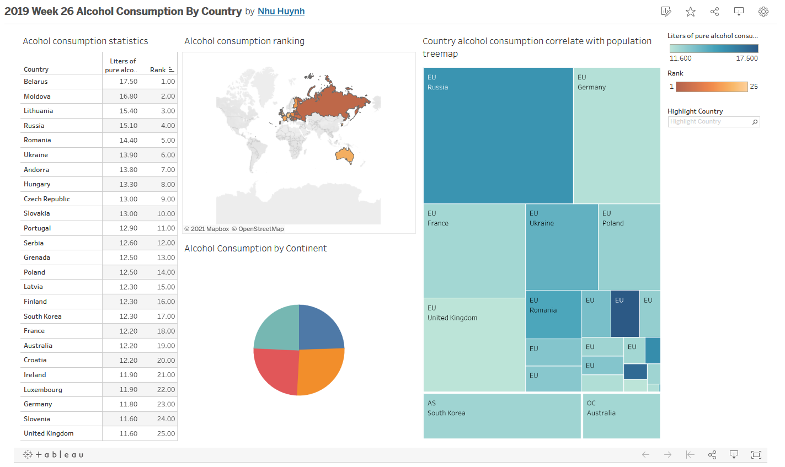

# Visualization

# Introduction
The original dataset is in [link](./Alcohol.xlsx).\
Though it was too simple and I fed up with basic data and for that reason I do a bit of joining together some of the dataset for getting region code and population of each country available in Alcohol.\
The new data created is stored inside [link](./new_acohol.csv).

Looking at the vix, though I was intended to see the correlation between alcohol consumption with its population, it was not the case. I have done some research and the reasons why people consume more alcohol then other is mainly mental issue and genetics reasons.\

Another things would be this dataset does not have a tons of data to visualize so you may need to find more information or another challenge if you want to work more interestingly.

